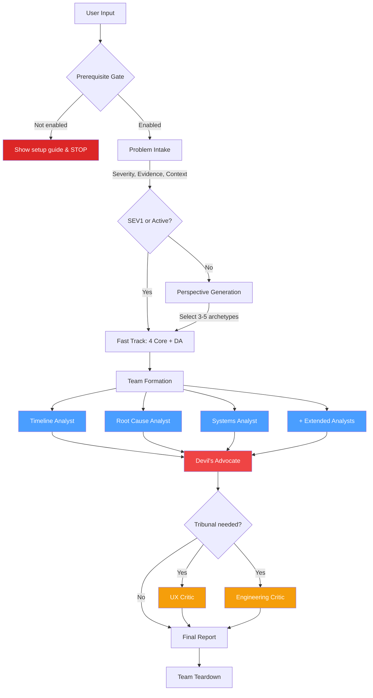
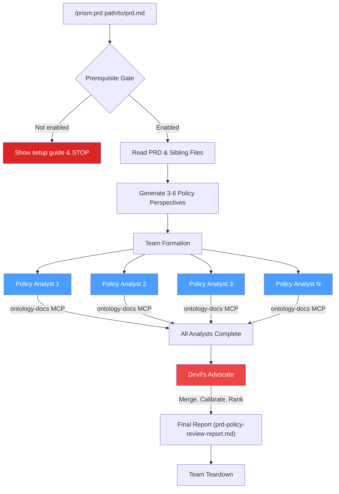
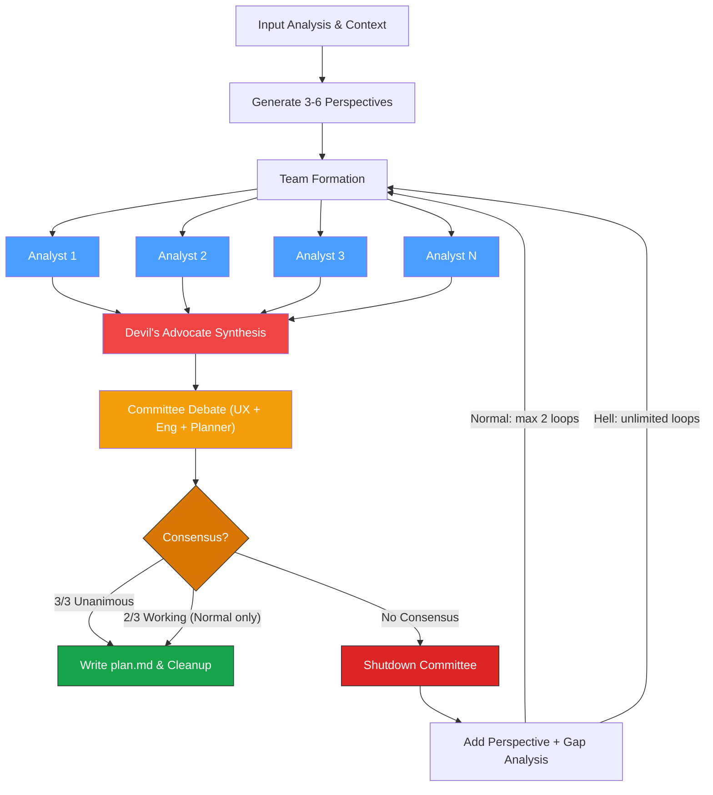

# Prism

Multi-perspective agent team analysis plugin for [Claude Code](https://docs.anthropic.com/en/docs/claude-code).

Prism spawns a coordinated team of specialized AI agents — each analyzing from a different perspective — then cross-validates findings through a Devil's Advocate before producing a final report.

## Philosophy

How has humanity solved its hardest problems? Diverse minds in a room, arguing until only the defensible ideas survive. Prism is that room — but the minds are AI specialists, and nobody gets to leave until the weak ideas are dead.

## Skills

| Skill | Command | Description |
|-------|---------|-------------|
| **incident** | `/prism:incident` | Incident postmortem with 3-6 perspective agents + Devil's Advocate + optional Tribunal |
| **prd** | `/prism:prd` | PRD policy conflict analysis against your reference docs via ontology-docs MCP |
| **plan** | `/prism:plan` | Multi-perspective planning with committee debate + consensus enforcement |

## Prerequisites

Before installing Prism, make sure you have:

1. **Claude Code** installed and working
2. **oh-my-claudecode** plugin installed (Prism uses its agent types for team members)

## Installation

### Step 1: Install the plugin

Inside Claude Code, register the Prism marketplace and install the plugin:

```
/plugin marketplace add valentin1235/prism
/plugin install prism@prism-plugins
```

Or from the terminal CLI:

```bash
claude plugin marketplace add valentin1235/prism
claude plugin install prism@prism-plugins
```

The plugin will be automatically enabled after installation. You can verify with `/plugin` (Installed tab) or:

```bash
claude plugin list
```

### Step 2: Enable Agent Team Mode

Prism uses multi-agent team features (TeamCreate, TaskList, SendMessage, etc.) which require Agent Team Mode to be enabled.

Open `~/.claude/settings.json` and add `CLAUDE_CODE_EXPERIMENTAL_AGENT_TEAMS` to the `env` section:

```json
{
  "env": {
    "CLAUDE_CODE_EXPERIMENTAL_AGENT_TEAMS": "1"
  }
}
```

If you already have an `env` section with other keys, just add the new key inside it:

```json
{
  "env": {
    "EXISTING_KEY": "existing_value",
    "CLAUDE_CODE_EXPERIMENTAL_AGENT_TEAMS": "1"
  }
}
```

**Restart Claude Code after making this change.**

> Without this setting, Prism skills will refuse to run and show a setup guide instead.

### Step 3: Install oh-my-claudecode (agent pack)

Prism does not have its own built-in agents. It currently uses [oh-my-claudecode](https://github.com/anthropics-community/oh-my-claudecode) as a general-purpose agent pack, which provides the specialized agent types needed for team analysis (`architect`, `architect-medium`, `analyst`, `critic`, etc.). Install it if you haven't already:

```
/plugin marketplace add Yeachan-Heo/oh-my-claudecode
/plugin install oh-my-claudecode@omc
```

Or from the terminal CLI:

```bash
claude plugin marketplace add Yeachan-Heo/oh-my-claudecode
claude plugin install oh-my-claudecode@omc
```

### Step 4: Configure ontology-docs MCP (optional)

All skills can reference your internal documentation through the `ontology-docs` MCP server. This is optional but recommended for accurate policy/codebase analysis.

Use the `claude mcp add` CLI command to register the server with **user scope**. Replace `/path/to/your/docs` with the absolute path to your documentation directory.

```bash
claude mcp add --transport stdio --scope user ontology-docs \
  -- npx -y @modelcontextprotocol/server-filesystem /path/to/your/docs
```

> **The server name must be exactly `ontology-docs`.** Prism skills internally reference `mcp__ontology-docs__*` tools by this name. Using a different name will cause the skills to fail.

> `--scope user` is recommended so the MCP server is available across all projects. With `local` or `project` scope, the server will only be accessible within that specific project.

Verify it was added:

```bash
claude mcp list
```

> For more details on MCP configuration, see the [official Claude Code MCP docs](https://code.claude.com/docs/en/mcp).

### Step 5: Verify installation

Restart Claude Code, then type:

```
/prism:incident
```

If everything is configured correctly, the skill will start the incident intake process. If Agent Team Mode is not enabled, it will show you the setup instructions.

## Full settings.json Example

After completing all installation steps, your `~/.claude/settings.json` should contain at least these entries. The `env` section must be added manually (Step 2), while `enabledPlugins` are added automatically by `claude plugin install`:

```json
{
  "env": {
    "CLAUDE_CODE_EXPERIMENTAL_AGENT_TEAMS": "1"
  },
  "enabledPlugins": {
    "oh-my-claudecode@omc": true,
    "prism@prism-plugins": true
  }
}
```

## Usage

### Incident Postmortem

```
/prism:incident
```

The skill will guide you through:

1. **Problem Intake** — Describe the incident, severity, and evidence
2. **Perspective Generation** — AI recommends 3-5 analysis perspectives based on your incident
3. **Team Formation** — Spawns specialized agents (Timeline, Root Cause, Systems, Impact, etc.)
4. **Analysis Execution** — Agents analyze in parallel, cross-validate findings
5. **Tribunal** (conditional) — UX + Engineering critics review recommendations if needed
6. **Report** — Structured postmortem report with findings and recommendations

**Available perspectives:**

| Core | Extended |
|------|----------|
| Timeline | Security & Threat |
| Root Cause | Data Integrity |
| Systems & Architecture | Performance & Capacity |
| Impact | Deployment & Change |
| | Network & Connectivity |
| | Concurrency & Race |
| | External Dependency |
| | User Experience |

---

### PRD Policy Analysis

```
/prism:prd path/to/your/prd.md
```

The skill will:

1. **Read & Analyze PRD** — Parse functional requirements, detect policy domains
2. **Generate Perspectives** — Create 3-6 orthogonal policy analysis perspectives
3. **Spawn Analysts** — Each analyst examines PRD against reference docs for their domain
4. **Devil's Advocate** — Merges duplicates, calibrates severity, finds gaps, ranks TOP 10 PM decisions
5. **Report** — Final policy analysis report written to the PRD's directory

**Output:** `prd-policy-review-report.md` in the same directory as the PRD file.

---

### Plan (Committee Debate)

```
/prism:plan path/to/prd.md
/prism:plan "Design a new payment system"
/prism:plan https://example.com/requirements
/prism:plan --hell path/to/prd.md    # Hell Mode: unanimous or infinite loop
```

The skill will:

1. **Input Analysis** — Detect input type (file/URL/text/conversation), extract context, identify gaps via user interview
2. **Perspective Generation** — Dynamically generate 3-6 orthogonal analysis perspectives based on input
3. **Team Formation** — Create agent team, artifact directory, and pre-assign all tasks
4. **Parallel Analysis** — Spawn analysts in parallel, each examining from their assigned perspective
5. **Devil's Advocate** — Merge findings, challenge assumptions, identify blind spots, stress-test feasibility
6. **Committee Debate** — UX Critic + Engineering Critic + Planner debate via Lead-mediated protocol
7. **Plan Output** — Write `plan.md` with execution phases, risk mitigation, and success metrics

**Input types:**

| Input Type | Detection | Action |
|-----------|-----------|--------|
| File path | `.md`, `.txt`, etc. | Read the file |
| URL | `http://` or `https://` | WebFetch |
| Text prompt | Plain text | Parse as requirements |
| No argument | During conversation | Summarize context |
| `--hell` | Hell Mode flag | Unanimous consensus required |

**Output:** `plan.md` in the same directory as the input file (or CWD).

## How It Works

<details>
<summary><b>Incident Postmortem</b> (<code>/prism:incident</code>)</summary>



</details>

<details>
<summary><b>PRD Policy Analysis</b> (<code>/prism:prd</code>)</summary>



</details>

<details>
<summary><b>Plan with Committee Debate</b> (<code>/prism:plan</code>)</summary>



</details>

**Normal Mode**: Working consensus (2/3) or better proceeds to output. Max 2 feedback loops, then forced output.

**Hell Mode** (`--hell`): Requires 3/3 unanimous on ALL elements. No iteration limit — cycles until unanimous or user stops. Each iteration shuts down the old committee (prevents position entrenchment) and spawns fresh agents with cumulative context.

| Consensus Level | Condition | Normal Mode | Hell Mode |
|-------|-----------|-------------|-----------|
| **Strong** | 3/3 agree | Output | Output |
| **Working** | 2/3 agree | Output | Feedback Loop |
| **No Consensus** | <60% | Feedback Loop | Feedback Loop |

All intermediate artifacts (`analyst-findings.md`, `da-synthesis.md`, `committee-debate.md`, `prior-iterations.md`) are persisted to `.omc/state/plan-{short-id}/` to survive context compression.

#### Agent Mapping

| Role | Agent Type | Model |
|------|-----------|-------|
| Analyst (complex) | `oh-my-claudecode:analyst` | opus |
| Analyst (standard) | `oh-my-claudecode:architect-medium` | sonnet |
| Devil's Advocate | `oh-my-claudecode:critic` | opus |
| UX Critic | `oh-my-claudecode:architect-medium` | sonnet |
| Engineering Critic | `oh-my-claudecode:architect` | opus |
| Planner | `oh-my-claudecode:planner` | opus |

## Troubleshooting

### "Agent Team Mode is not enabled"

Add `"CLAUDE_CODE_EXPERIMENTAL_AGENT_TEAMS": "1"` to the `env` section of `~/.claude/settings.json` and restart Claude Code. See [Step 2](#step-2-enable-agent-team-mode).

### "ontology-docs MCP not configured"

The skill tried to access reference docs but the MCP server isn't set up. See [Step 4](#step-4-configure-ontology-docs-mcp-optional).

### Agents not spawning / TeamCreate fails

Make sure `oh-my-claudecode` plugin is installed and enabled. Prism's agents depend on oh-my-claudecode agent types. See [Step 3](#step-3-install-oh-my-claudecode-dependency).

### Skill not showing in autocomplete

Make sure `"prism@prism-plugins": true` is in your `enabledPlugins` and restart Claude Code.

## License

MIT
