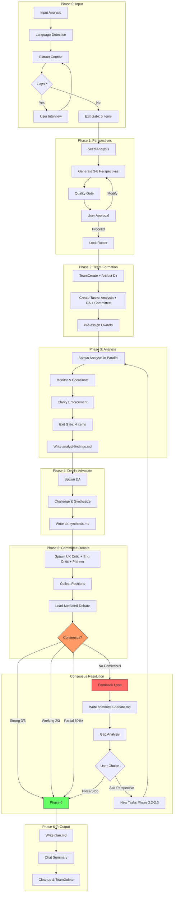
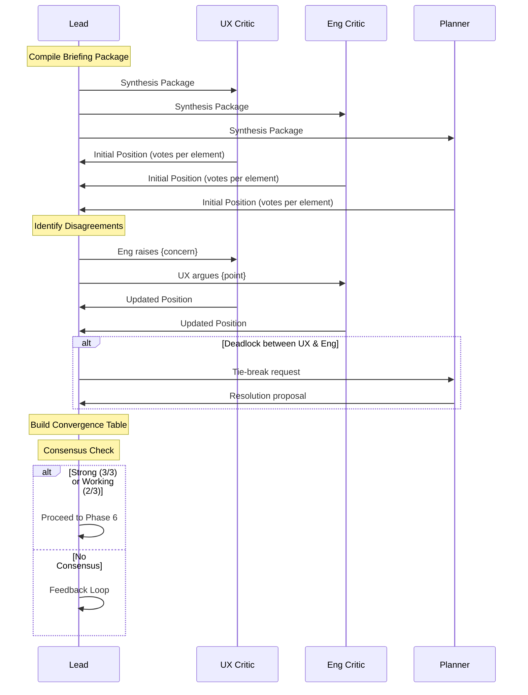
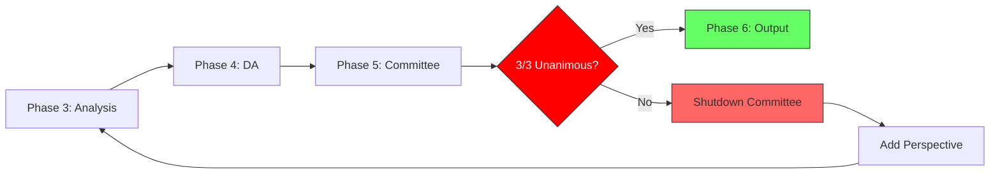
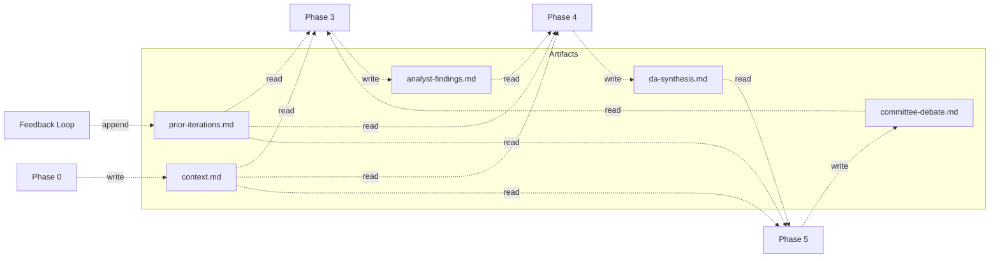

# Prism

Multi-perspective agent team analysis plugin for Claude Code.

## Skills

| Skill | Purpose | Invocation |
|-------|---------|------------|
| **incident** | Multi-perspective incident postmortem with devil's advocate | `/prism:incident` |
| **prd** | PRD policy conflict analysis against existing docs | `/prism:prd` |
| **plan** | Multi-perspective planning with committee debate | `/prism:plan` |

## Plan Skill

Analyzes input from multiple dynamically-generated perspectives, synthesizes via Devil's Advocate, and produces actionable execution plans through a 3-person committee debate with consensus enforcement.

### Input

```
/prism:plan path/to/prd.md
/prism:plan "Design a new payment system"
/prism:plan https://example.com/requirements
/prism:plan --hell path/to/prd.md    # Hell Mode: unanimous or infinite loop
```

| Input Type | Detection | Action |
|-----------|-----------|--------|
| File path | `.md`, `.txt`, etc. | Read the file |
| URL | `http://` or `https://` | WebFetch |
| Text prompt | Plain text | Parse as requirements |
| No argument | During conversation | Summarize context |
| `--hell` | Hell Mode flag | Unanimous consensus required |

### Architecture



### Committee Debate Protocol



### Hell Mode



Hell Mode (`--hell`) requires **3/3 unanimous consensus** on ALL plan elements. The feedback loop has **no iteration limit** — it cycles through Phase 3 → 4 → 5 until every element achieves Strong consensus, or the user manually stops.

Each iteration:
1. Shuts down old committee (prevents position entrenchment)
2. Appends iteration summary to `prior-iterations.md`
3. Creates new tasks, spawns new agents with cumulative context
4. New committee receives all prior analysis + debate history

### Artifact Persistence

All intermediate results are persisted to `.omc/state/plan-{short-id}/` to survive context compression:



### Consensus Levels

| Level | Condition | Normal Mode | Hell Mode |
|-------|-----------|-------------|-----------|
| **Strong** | 3/3 agree | Phase 6 | Phase 6 |
| **Working** | 2/3, 1 dissent | Phase 6 | Feedback Loop |
| **Partial** | 60%+ elements | Phase 6 | Feedback Loop |
| **No Consensus** | <60% | Feedback Loop | Feedback Loop |

**Normal Mode**: max 2 feedback loops, then forced Phase 6.
**Hell Mode**: no limit until 3/3 unanimous.

### Agent Mapping

| Role | Agent Type | Model |
|------|-----------|-------|
| Analyst (complex) | `oh-my-claudecode:analyst` | opus |
| Analyst (standard) | `oh-my-claudecode:architect-medium` | sonnet |
| Devil's Advocate | `oh-my-claudecode:critic` | opus |
| UX Critic | `oh-my-claudecode:architect-medium` | sonnet |
| Engineering Critic | `oh-my-claudecode:architect` | opus |
| Planner | `oh-my-claudecode:planner` | opus |

### File Structure

```
skills/plan/
├── SKILL.md                        # Main skill definition (491 lines)
├── prompts/
│   ├── analyst.md                  # Dynamic analyst template
│   ├── devil-advocate.md           # DA synthesis prompt
│   └── committee/
│       ├── ux-critic.md            # UX Critic prompt
│       ├── engineering-critic.md   # Engineering Critic prompt
│       └── planner.md             # Planner prompt (tie-breaker)
└── templates/
    └── plan-output.md              # Final plan output template
```

## Incident Skill

Multi-perspective incident postmortem with 4 core + 9 extended archetypes, devil's advocate challenge, and optional tribunal review.

```
/prism:incident
```

## PRD Skill

Multi-perspective PRD policy conflict analysis against existing policy documents via podo-docs MCP.

```
/prism:prd path/to/prd.md
```

## Requirements

- Claude Code with Agent Teams enabled:
  ```json
  // ~/.claude/settings.json
  { "env": { "CLAUDE_CODE_EXPERIMENTAL_AGENT_TEAMS": "1" } }
  ```

## License

See [LICENSE](./LICENSE).
