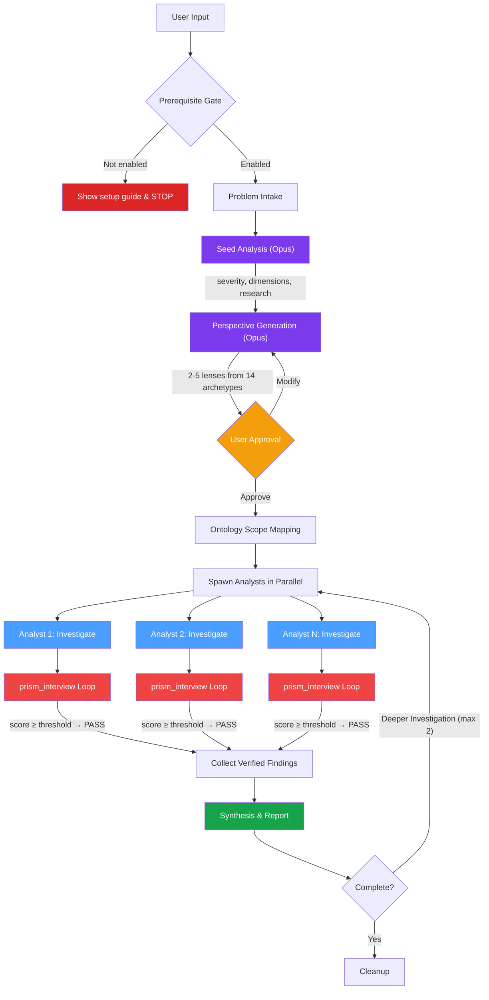
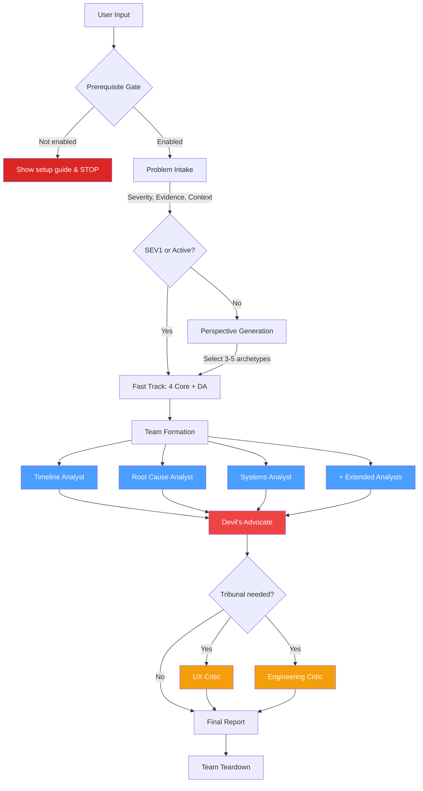
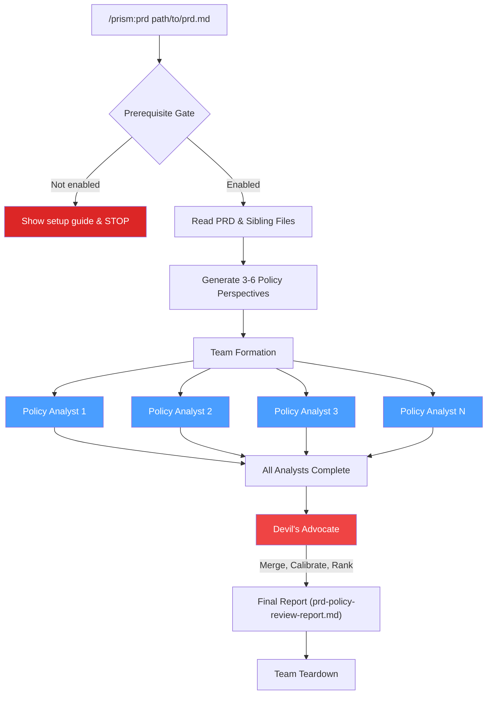
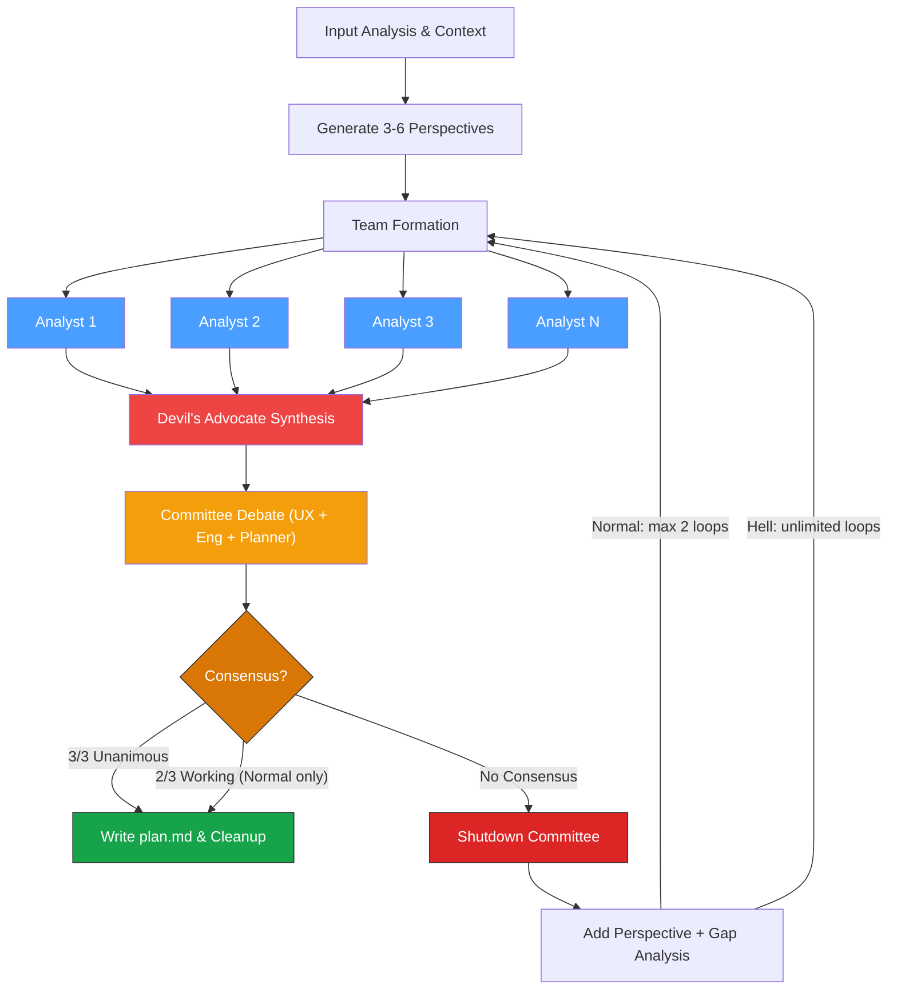

# Prism

Multi-perspective agent team analysis for [Claude Code](https://docs.anthropic.com/en/docs/claude-code) and Codex.

Prism spawns a coordinated team of specialized AI agents — each analyzing from a different perspective — then cross-validates findings through a Devil's Advocate before producing a final report.

## Philosophy

How has humanity solved its hardest problems? Diverse minds in a room, arguing until only the defensible ideas survive. Prism is that room — but the minds are AI specialists, and nobody gets to leave until the weak ideas are dead.

## Commands

| Skill | Claude Code | Codex | Description |
|-------|-------------|-------|-------------|
| **analyze** | `/prism:analyze` | `psm analyze` | General-purpose multi-perspective analysis with MCP-based Socratic verification + ambiguity scoring |
| **incident** | `/prism:incident` | `psm incident` | Incident postmortem with 3-6 perspective agents + Devil's Advocate + optional Tribunal |
| **prd** | `/prism:prd` | `psm prd` | PRD policy conflict analysis against your reference docs |
| **setup** | `/prism:setup` | `psm setup` | Runtime-aware setup plus brownfield default repository management |

## Prerequisites

Before installing Prism, make sure you have one supported runtime installed:

1. **Claude Code** for `/prism:*` commands inside Claude Code
2. **Codex CLI** for `psm *` commands inside Codex

If you plan to use Prism in Claude Code, also install **oh-my-claudecode** because Prism uses its agent types for team members.

## Installation

Prism keeps its active runtime in `~/.prism/config.yaml`, similar to Ouroboros. The shared setup entrypoint is:

```bash
bash scripts/setup.sh --runtime <claude|codex>
```

Use `--runtime codex` if you want global `psm` commands in Codex. Use `--runtime claude` if you want Claude Code as the active backend.

### Codex Installation

From the Prism repo:

```bash
bash scripts/setup.sh --runtime codex
```

Then make sure `~/.codex/bin` is on your `PATH`:

```bash
export PATH="$HOME/.codex/bin:$PATH"
```

Start a new Codex session and run:

```text
psm setup
psm analyze
psm brownfield
```

Quick verification:

```bash
which psm
cat ~/.prism/config.yaml
```

Expected result:
- `which psm` points to `~/.codex/bin/psm`
- `~/.prism/config.yaml` contains `runtime.backend: codex`

### Claude Code Installation

#### Step 1: Install the plugin

Inside Claude Code, register the Prism marketplace and install the plugin:

```
/plugin marketplace add valentin1235/prism
/plugin install prism@prism
```

Or from the terminal CLI:

```bash
claude plugin marketplace add valentin1235/prism
claude plugin install prism@prism
```

The plugin will be automatically enabled after installation. You can verify with `/plugin` (Installed tab) or:

```bash
claude plugin list
```

#### Step 2: Enable Agent Team Mode

Prism uses multi-agent team features (TeamCreate, TaskList, SendMessage, etc.) which require Agent Team Mode to be enabled.

Open `~/.claude/settings.json` and add `CLAUDE_CODE_EXPERIMENTAL_AGENT_TEAMS` to the `env` section:

```json
{
  "env": {
    "CLAUDE_CODE_EXPERIMENTAL_AGENT_TEAMS": "1"
  }
}
```

If you already have an `env` section with other keys, just add the new key inside it:

```json
{
  "env": {
    "EXISTING_KEY": "existing_value",
    "CLAUDE_CODE_EXPERIMENTAL_AGENT_TEAMS": "1"
  }
}
```

**Restart Claude Code after making this change.**

> Without this setting, Prism skills will refuse to run and show a setup guide instead.

#### Step 3: Install oh-my-claudecode (agent pack)

Prism does not have its own built-in agents. It currently uses [oh-my-claudecode](https://github.com/anthropics-community/oh-my-claudecode) as a general-purpose agent pack, which provides the specialized agent types needed for team analysis (`architect`, `architect-medium`, `analyst`, etc.). The `critic` role has been replaced by Prism's built-in `devils-advocate` agent. Install oh-my-claudecode if you haven't already:

```
/plugin marketplace add Yeachan-Heo/oh-my-claudecode
/plugin install oh-my-claudecode@omc
```

Or from the terminal CLI:

```bash
claude plugin marketplace add Yeachan-Heo/oh-my-claudecode
claude plugin install oh-my-claudecode@omc
```

#### Step 4: Select the Claude runtime

From the Prism repo:

```bash
bash scripts/setup.sh --runtime claude
```

Then open Claude Code and run:

```
/prism:setup
```

This keeps `~/.prism/config.yaml` aligned with Claude Code and configures the MCP tools (`prism_interview`) used by the analyze skill's Socratic verification.

#### Step 5: Verify installation

Restart Claude Code, then type:

```
/prism:incident
```

If everything is configured correctly, the skill will start the incident intake process. If Agent Team Mode is not enabled, it will show you the setup instructions.

Quick verification from the terminal:

```bash
cat ~/.prism/config.yaml
```

Expected result:
- `~/.prism/config.yaml` contains `runtime.backend: claude`

## Full settings.json Example

After completing all installation steps, your `~/.claude/settings.json` should contain at least these entries. The `env` section must be added manually (Step 2), while `enabledPlugins` are added automatically by `claude plugin install`:

```json
{
  "env": {
    "CLAUDE_CODE_EXPERIMENTAL_AGENT_TEAMS": "1"
  },
  "enabledPlugins": {
    "oh-my-claudecode@omc": true,
    "prism@prism": true
  }
}
```

## Usage

### Codex

```text
psm setup
psm brownfield
psm analyze
psm incident
psm prd path/to/prd.md
```

### Claude Code

```text
/prism:setup
/prism:analyze
/prism:incident
/prism:prd path/to/prd.md
```

### Shared workflow summary

| Skill | Workflow | Output |
|-------|---------|--------|
| **analyze** | Intake → Seed Analysis → Perspective Generation → Parallel Analysts → Socratic Verification (per analyst) → Synthesis | Analysis report |
| **incident** | Intake → Seed Analysis → 3-6 Perspective Agents → Devil's Advocate → optional Tribunal → Report | Postmortem report |
| **prd** | Read PRD → 3-6 Policy Analysts → Devil's Advocate → Report | `prd-policy-review-report.md` |
| **plan** | Input Analysis → 3-6 Analysts → Devil's Advocate → Committee Debate (UX + Eng + Planner) → Consensus Loop → Plan | `plan.md` |

All skills share the same core pattern: **spawn multi-perspective agents → cross-validate → synthesize**. See [How It Works](#how-it-works) for detailed flow diagrams.

### analyze: Socratic Verification & Ambiguity Scoring

The analyze skill adds MCP-based Socratic verification on top of the shared pattern. Each analyst self-verifies through a `prism_interview` loop before reporting:

```
Analyst → write findings.json → prism_interview(start) → question
       → answer (with evidence) → auto-score → next question
       → ... repeat until PASS or max rounds
```

**Ambiguity Score:**

| Dimension | Weight | Measures |
|-----------|--------|----------|
| Evidence Clarity | 0.4 | Findings backed by concrete evidence (file, line, log)? |
| Causal Chain Clarity | 0.35 | Cause-effect chain logically sound and complete? |
| Recommendation Clarity | 0.25 | Recommendations specific and actionable? |

Verdict: **PASS** (score meets threshold) or **FORCE PASS** (max rounds reached, flagged for user attention).

---

## Inspired By

Prism's multi-perspective analysis and Socratic verification approach was inspired by [Ouroboros](https://github.com/Q00/ouroboros).

---

## How It Works

<details>
<summary><b>Analyze with Socratic Verification</b> (<code>/prism:analyze</code>)</summary>


```mermaid
graph TD
    A[User Input] --> B{Prerequisite Gate}
    B -->|Not enabled| X[Show setup guide & STOP]
    B -->|Enabled| C[Problem Intake]

    C --> D["Seed Analysis (Opus)"]
    D -->|"severity, dimensions, research"| E["Perspective Generation (Opus)"]
    E -->|"2-5 lenses from 14 archetypes"| F{User Approval}

    F -->|Modify| E
    F -->|Approve| G[Ontology Scope Mapping]
    G --> H[Spawn Analysts in Parallel]

    H --> I1[Analyst 1: Investigate]
    H --> I2[Analyst 2: Investigate]
    H --> IN[Analyst N: Investigate]

    I1 --> J1["prism_interview Loop"]
    I2 --> J2["prism_interview Loop"]
    IN --> JN["prism_interview Loop"]

    J1 -->|"score ≥ threshold → PASS"| K[Collect Verified Findings]
    J2 -->|"score ≥ threshold → PASS"| K
    JN -->|"score ≥ threshold → PASS"| K

    K --> L[Synthesis & Report]
    L --> M{Complete?}
    M -->|Yes| N[Cleanup]
    M -->|"Deeper Investigation (max 2)"| H

    style D fill:#7c3aed,color:#fff
    style E fill:#7c3aed,color:#fff
    style I1 fill:#4a9eff,color:#fff
    style I2 fill:#4a9eff,color:#fff
    style IN fill:#4a9eff,color:#fff
    style J1 fill:#ef4444,color:#fff
    style J2 fill:#ef4444,color:#fff
    style JN fill:#ef4444,color:#fff
    style F fill:#f59e0b,color:#fff
    style X fill:#dc2626,color:#fff
    style L fill:#16a34a,color:#fff
```

</details>

<details>
<summary><b>Incident Postmortem</b> (<code>/prism:incident</code>)</summary>


```mermaid
graph TD
    A[User Input] --> B{Prerequisite Gate}
    B -->|Not enabled| X[Show setup guide & STOP]
    B -->|Enabled| C[Problem Intake]
    C -->|Severity, Evidence, Context| D{SEV1 or Active?}

    D -->|Yes| E1[Fast Track: 4 Core + DA]
    D -->|No| E2[Perspective Generation]
    E2 -->|Select 3-5 archetypes| E1

    E1 --> F[Team Formation]

    F --> G1[Timeline Analyst]
    F --> G2[Root Cause Analyst]
    F --> G3[Systems Analyst]
    F --> GN[+ Extended Analysts]

    G1 --> H[Devil's Advocate]
    G2 --> H
    G3 --> H
    GN --> H

    H --> I{Tribunal needed?}
    I -->|Yes| J1[UX Critic]
    I -->|Yes| J2[Engineering Critic]
    I -->|No| K

    J1 --> K[Final Report]
    J2 --> K

    K --> L[Team Teardown]

    style G1 fill:#4a9eff,color:#fff
    style G2 fill:#4a9eff,color:#fff
    style G3 fill:#4a9eff,color:#fff
    style GN fill:#4a9eff,color:#fff
    style H fill:#ef4444,color:#fff
    style J1 fill:#f59e0b,color:#fff
    style J2 fill:#f59e0b,color:#fff
    style X fill:#dc2626,color:#fff
```

</details>

<details>
<summary><b>PRD Policy Analysis</b> (<code>/prism:prd</code>)</summary>


```mermaid
graph TD
    A["/prism:prd path/to/prd.md"] --> B{Prerequisite Gate}
    B -->|Not enabled| X[Show setup guide & STOP]
    B -->|Enabled| C[Read PRD & Sibling Files]
    C --> D[Generate 3-6 Policy Perspectives]

    D --> E[Team Formation]

    E --> F1[Policy Analyst 1]
    E --> F2[Policy Analyst 2]
    E --> F3[Policy Analyst 3]
    E --> FN[Policy Analyst N]

    F1 --> G[All Analysts Complete]
    F2 --> G
    F3 --> G
    FN --> G

    G --> H[Devil's Advocate]
    H -->|Merge, Calibrate, Rank| I["Final Report (prd-policy-review-report.md)"]

    I --> J[Team Teardown]

    style F1 fill:#4a9eff,color:#fff
    style F2 fill:#4a9eff,color:#fff
    style F3 fill:#4a9eff,color:#fff
    style FN fill:#4a9eff,color:#fff
    style H fill:#ef4444,color:#fff
    style X fill:#dc2626,color:#fff
```

</details>

<details>
<summary><b>Plan with Committee Debate</b> (<code>/prism:plan</code>)</summary>


```mermaid
graph TD
    A[Input Analysis & Context] --> B[Generate 3-6 Perspectives]
    B --> C[Team Formation]

    C --> D1[Analyst 1]
    C --> D2[Analyst 2]
    C --> D3[Analyst 3]
    C --> DN[Analyst N]

    D1 --> E[Devil's Advocate Synthesis]
    D2 --> E
    D3 --> E
    DN --> E

    E --> F["Committee Debate (UX + Eng + Planner)"]
    F --> G{Consensus?}

    G -->|"3/3 Unanimous"| H["Write plan.md & Cleanup"]
    G -->|"2/3 Working (Normal only)"| H
    G -->|"No Consensus"| I[Shutdown Committee]
    I --> J[Add Perspective + Gap Analysis]

    J -->|"Normal: max 2 loops"| C
    J -->|"Hell: unlimited loops"| C

    style D1 fill:#4a9eff,color:#fff
    style D2 fill:#4a9eff,color:#fff
    style D3 fill:#4a9eff,color:#fff
    style DN fill:#4a9eff,color:#fff
    style E fill:#ef4444,color:#fff
    style F fill:#f59e0b,color:#fff
    style G fill:#d97706,color:#fff,stroke:#333
    style H fill:#16a34a,color:#fff,stroke:#333
    style I fill:#dc2626,color:#fff,stroke:#333
```

</details>

### plan: Consensus Modes

| Consensus Level | Condition | Normal Mode | Hell Mode (`--hell`) |
|-------|-----------|-------------|-----------|
| **Strong** | 3/3 agree | Output | Output |
| **Working** | 2/3 agree | Output | Feedback Loop |
| **No Consensus** | <60% | Feedback Loop | Feedback Loop |

Normal Mode: max 2 feedback loops, then forced output. Hell Mode: unlimited loops until unanimous.

### Agent Mapping

| Role | Agent Type | Model |
|------|-----------|-------|
| Analyst (complex) | `oh-my-claudecode:analyst` | opus |
| Analyst (standard) | `oh-my-claudecode:architect-medium` | sonnet |
| Devil's Advocate | `prism:devils-advocate` | opus |
| UX / Engineering Critic | `oh-my-claudecode:architect` / `architect-medium` | opus / sonnet |
| Planner | `oh-my-claudecode:planner` | opus |

## Troubleshooting

### "Agent Team Mode is not enabled"

Add `"CLAUDE_CODE_EXPERIMENTAL_AGENT_TEAMS": "1"` to the `env` section of `~/.claude/settings.json` and restart Claude Code. See [Step 2](#step-2-enable-agent-team-mode).

### "Reference docs not configured"

The skill tried to access reference docs but no brownfield repositories are configured. Run `/prism:setup` to configure them.

### Agents not spawning / TeamCreate fails

Make sure `oh-my-claudecode` plugin is installed and enabled. Prism's analyst agents depend on oh-my-claudecode agent types (the `critic` role uses Prism's built-in `devils-advocate` agent instead). See [Step 3](#step-3-install-oh-my-claudecode-agent-pack).

### Skill not showing in autocomplete

Make sure `"prism@prism": true` is in your `enabledPlugins` and restart Claude Code.

## License

MIT
